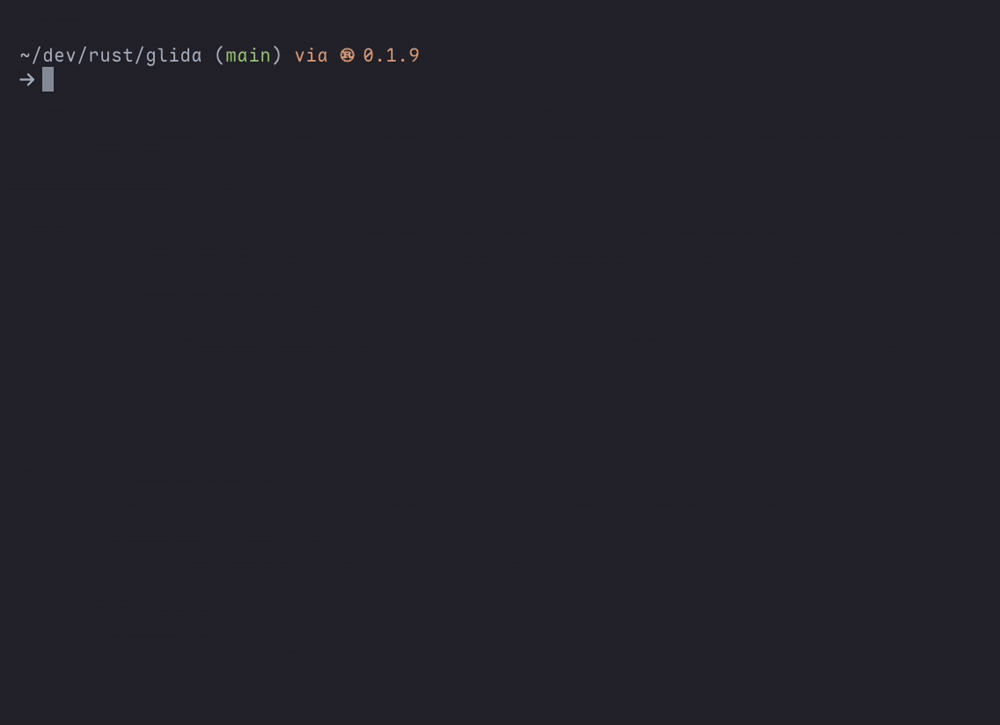

<p align="center">
    
</p>
  
<p align="center">
  <em>A fast, language-aware CLI tool that counts lines<br>of code, comments, and blanks across projects.</em>
</p>
  
<p align="center">
    
    
  
</p>
  
<p align="center">
  <a href="#install">Install</a> •
  <a href="#usage">Usage</a> •
  <a href="#dependencies">Dependencies</a> •
  <a href="#license">License</a>
</p>  
   
<p align="center">
  
</p>
  
---
<div id="install"></div>

## Install
    
``` bash
cargo install glida
```
   
---
<div id="usage"></div>

## Usage
    
``` bash
glida <target dir>
```
  
``` bash
glida help
```
  
---
<div id="license"></div>

## License
This project is licensed under the [MIT License](https://github.com/simon-danielsson/glida/blob/main/LICENSE).  
  
---
<div id="dependencies"></div>

## Dependencies
  
- [walkdir](https://github.com/BurntSushi/walkdir)  
- [indicatif](https://github.com/console-rs/indicatif)  
